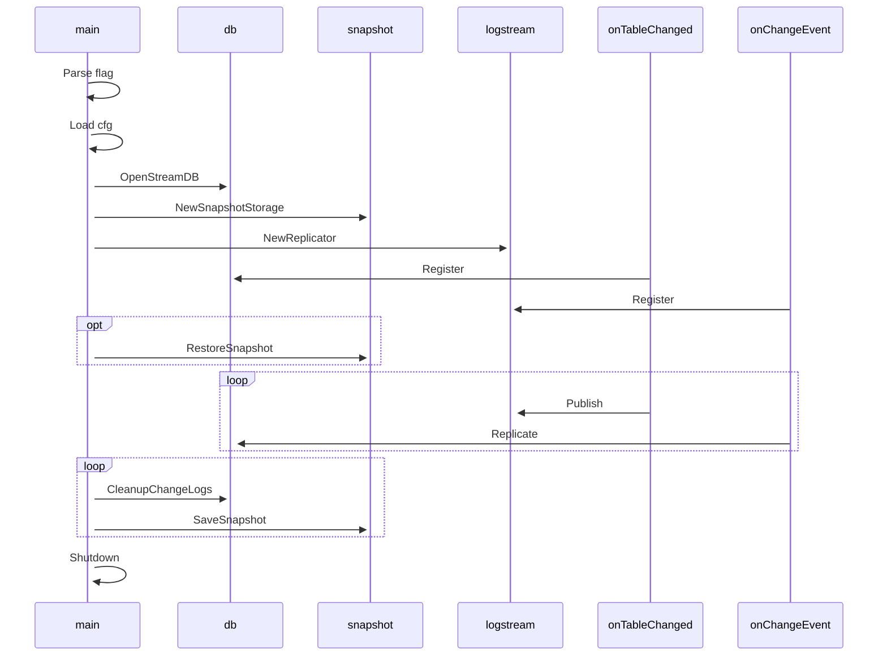

# How does it work?

There are multiple components in Marmot that make it work. Let's look at them one by one: 



## Triggers and data capture

Marmot works by using a pretty basic trick so that each process that's access database can capture changes,
and then Marmot can publish them to rest of the nodes. This is how it works internally:

- Global table `__marmot___global_change_log` that captures exact sequence of operations committed to DB.
  Ideally we should be able to keep the changed as JSON blob inline, but due to limitation of SQLites
  JSON not able to serialize BLOBs as JSON property we for now keep a different table with values as
  columns in the table. So each table gets a `__marmot__<table_name>_change_log` that will record
  the value changed. Each column name in table change log is prefixed by `val_` prefix (i.e. `id`
  becomes `val_id`). These triggers are compiled via Go's builtin templating system, and installed
  to database at boot time.
  
- Each `insert`, `update`, `delete` triggers for every table `AFTER` the changes have been
  committed to the table. These triggers record `OLD` (ON DELETE) or `NEW` (ON INSERT OR 
  UPDATE) values into the table.

## Replication

When you are running Marmot process, it's watching for changes on DB file and WAL file. Everytime there is a change
Marmot:

- Gathers all change records, and for each record calculate a consistent hash based on table name + primary keys.
- Using the hash decide JetStream and subject the change belongs to. And publish the change into that specific JetStream.
- Once JetStream has replicated the change log, mark the change published.
- As soon as change is published to JetStream rest of the nodes replay that log, and row changes are applied via state machine
  to local tables of the node. This means every row in database due to RAFT consensus at stream level will have only one 
  deterministic order of changes getting in cluster in case of race-conditions.
- Once the order is determined for a change it's applied in an upsert or delete manner to the table. So it's quite
  possible that a row committed locally is overwritten or replaced later because it was not the last one
  in order of cluster wide commit order.
  
## Changelog format

Changelog is a CBOR serialized (and compressed if configured) payload that has following interface definition:

```typescript
interface MarmotPublishedRow {
  FromNodeId: number;
  Payload: {
    Id: number;
    Type: "insert" | "update" | "delete";
    TableName: string;
    Row: {[ColumnName: string]: any}
  };
}
```

`FromNodeId` points to node ID who sent the changelog (configured when launching).
`Payload.TableName` points to the table that changed with mutation type of
`Payload.Type`. Then `Payload.Row` contains flat map of column
name to value.

> There is alot of optimization that can be done to this payload overall, in future using
> ProtoBuf or more optimized serialization format is absolutely an open option.

### Changelog Cleanup
Marmot performs periodic cleanup of change logs that were created before a specified time (default: 5 seconds). 
It iterates over the watched tables, deletes entries from their respective meta tables where the state is "Published" and the creation time is earlier than the specified time.

## Snapshotting

In a normal distributed system it's pretty typical for nodes to go down for really long time. In that particular
case a node coming back up can be lagging so far behind that `max-log-entries` might not be sufficient to
fully play all logs and restore the state of database. In that case it required that a node restores a
snapshot and apply current log entries to be fully up-to-date.

Marmot supports taking snapshot and being able to fully restore it via
[NATS Object Storage](https://docs.nats.io/using-nats/developer/develop_jetstream/object), S3 (and compatible APIs including BlackBlaze and Minio), Azure Blob, and SFTP.

### Saving Snapshot
Everytime a node publishes a new change log to NATs, it saves sequence number of the entry in JetStream. The saved
sequence number will be used later once the node tries to boot up. Let's first look at how snapshot is saved.

In order to keep enough headroom it calculates max snapshot entries by dividing `max-log-entries` by total number
of `shards` e.g. `max-log-entries` of 1024 and total 8 shards will result in 128 max snapshot entries. Now anytime
sequence number of shard 1 is multiple of 128 a snapshot will be taken and uploaded to NATS Object. The snapshot
will be saved in `OBJ_<stream-prefix>-snapshot-store`. Statistically due to even distribution of hashes among shards
everytime shard 1 hit max snapshot entries, rest of the shards will have almost same number of new entries.

| Component | Description |
|-----------|-------------|
| `ReplicationLog.MaxEntries` | A configuration value that specifies the maximum number of entries that can be stored in the replication log. Determines the total number of entries that can be stored across all shards.|
| `r.shards` | The number of shards in the replication system. Each shard handles a portion of the data. | 
| `snapshotEntries` | Calculated as `ReplicationLog.MaxEntries / r.shards`. Determine the frequency of snapshot saving. A snapshot is saved every `snapshotEntries` number of entries for the shard 1. |

The condition if snapshotEntries != 0 && seq%snapshotEntries == 0 && shardID == 1 checks if the current sequence number (seq) is a multiple of snapshotEntries and if the current shard is the snapshot shard. If both conditions are true, a snapshot is saved.

Once it has been decided that system wants to save snapshot, a temporary path is created where we used awesome feature
of SQLite called `VACUUM INTO <PATH>`. Where SQLite optimizes the DB, and gives us a compacted snapshot of database.
After which Marmot removes all the hooks, and triggers from the snapshot, and re-VACUUM packs the database for upload.
Once done this snapshot is uploaded to `OBJ_<stream-prefix>-snapshot-store` (`<stream-prefix>-snapshot-store` in
client API).

One important thing to keep in mind is everytime Marmot sees a sequence number in a shard higher than what it
has seen before it will record it against that shard, and this whole mapping is saved on specified sequence
map file path `seq-map-path`.


### Restoring Snapshot
Whenever a node boots up it first verifies the DB file integrity and performs any WAL checkpoints. Then it loads the
shard mapping from `seq-map-path` and compare it to corresponding JetStream's starting sequence number. If the
sequence number that node has is less than start sequence number that simply means node can't reconstruct the
exact state of database by replaying all logs it's missing. In this case node downloads the snapshot from
NATs server as specified in section above. This snapshot is downloaded in a temporary path. Marmot then
uses `exclusive` transaction lock to prevent any writers from getting into DB while it copies over
the files.

Once snapshot has been copied over, Marmot installs same triggers, and change log tables again in DB, and starts
processing logs applying them all on the snapshot. This means while Marmot is restoring the DB it's quite
possible that you might have an outdated copy of database until the logs are fully applied.

```mermaid
sequenceDiagram
    participant Marmot1 as Marmot 1
    participant logstream as logstream
    participant Marmot2 as Marmot 2

    Marmot1->>logstream: Replication (seq:1)

    logstream->>Marmot2: Replication (seq:1)

    Marmot1->>logstream: Replication continues (seq:2)

    logstream->>Marmot2: Replication continues (seq:2)

    Note over Marmot2: Marmot Process 2 goes down for a long period of time

    Marmot1->>logstream: ......

    Marmot1->>Marmot1: Save snapshot (seq:2000)

    Marmot1->>logstream: Replication continues (seq:2001)

    Marmot1->>logstream: Replication continues (seq:2002)

    Note over Marmot2: Marmot Process 2 restarts

    Marmot2->>Marmot2: First sequence number of logstream (seq:978) > saved sequence number (seq:2)?
    alt Yes
        Marmot2->>Marmot2: Restore snapshot with seq: 2000 and pick up changes from 2001
    else No
        Marmot2->>Marmot2: Pick up changes from the saved sequence number
    end
  ```

## Monitoring

### Prometheus Metrics
| Field Name | Type | Description |
|------------|------|-------------|
| published | Counter | Number of rows published |
| pending_publish | Gauge | Number of rows pending publishing |
| count_changes | Histogram | Latency of counting changes in microseconds |
| scan_changes | Histogram | Latency of scanning change rows in the database |

### Error Scenarios

| Scenario | Description |
| --- | --- |
| Configuration Load Failure | If there's an error loading the configuration (`cfg.Load(*cfg.ConfigPathFlag)`), Marmot will panic and exit. |
| Database Open Failure | If the program fails to open the database (`db.OpenStreamDB(cfg.Config.DBPath)`), it logs an error and returns, which will cause Marmot to exit. |
| Cleanup Change Data Capture Pipeline Failure | If the cleanup flag (`*cfg.CleanupFlag`) is set and there's an error during the cleanup process (`streamDB.RemoveCDC(true)`), Marmot will panic and exit. |
| Snapshot Storage Initialization Failure | If there's an error initializing the snapshot storage (`snapshot.NewSnapshotStorage()`), Marmot will panic and exit. |
| Replicator Initialization Failure | If there's an error initializing the replicators (`logstream.NewReplicator(snapshot.NewNatsDBSnapshot(streamDB, snpStore))`), Marmot will panic and exit. |
| Snapshot Restoration Failure | If snapshot and replication are enabled (`cfg.Config.Snapshot.Enable && cfg.Config.Replicate`) and there's an error restoring the snapshot (`replicator.RestoreSnapshot()`), Marmot will panic and exit. |
| Table Listing Failure | If there's an error listing all tables (`db.GetAllDBTables(cfg.Config.DBPath)`), it logs an error and returns, which will cause Marmot to exit. |
| Change Data Capture Pipeline Installation Failure | If there's an error installing the change data capture pipeline (`streamDB.InstallCDC(tableNames)`), it logs an error and returns, which will cause Marmot to exit. |